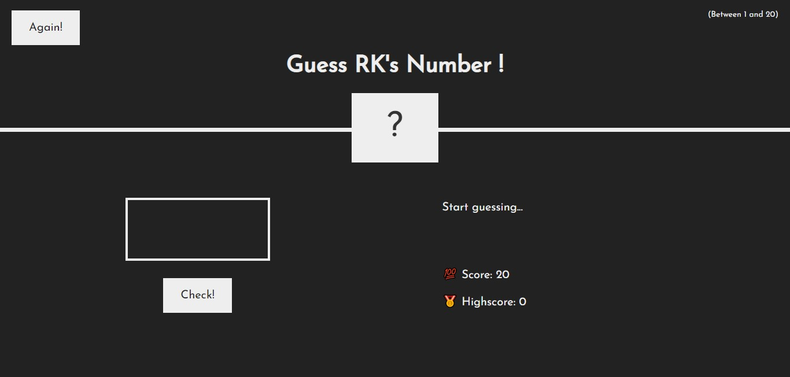
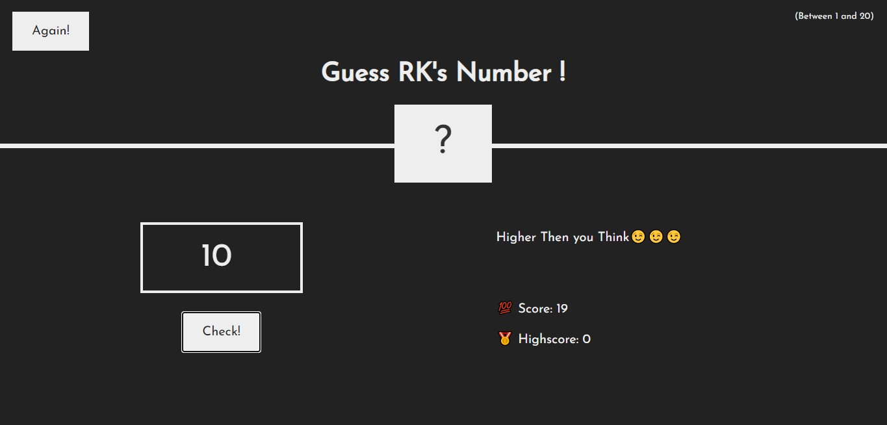
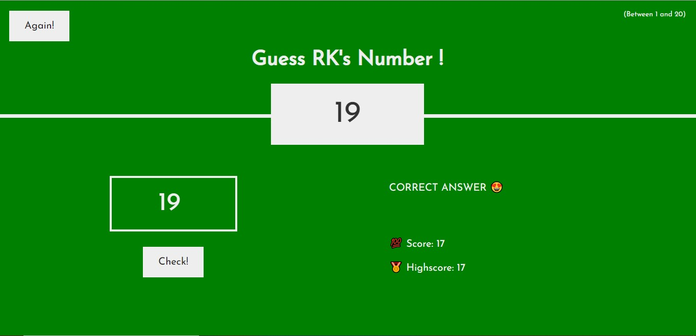
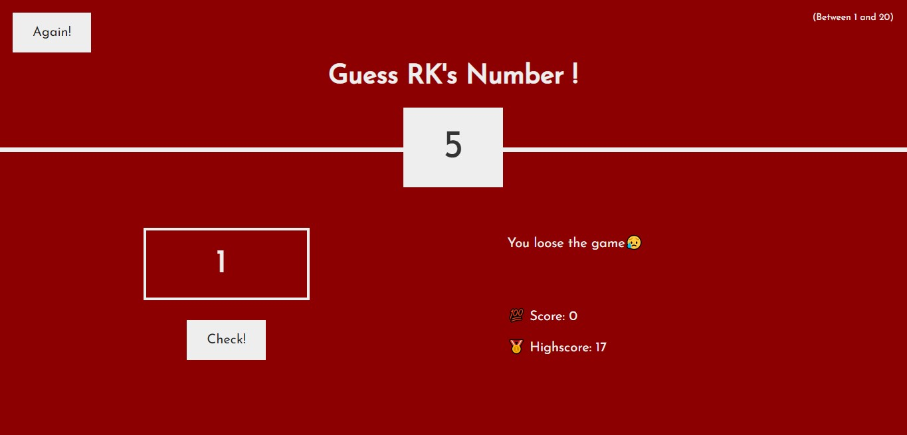

# Guess-Rk-s-Number
**a very very simple project of HTML,CSS,JS** 
**you have to guess my number(1-20)** 

**At each guess, you will get a hint and at each wrong guess, your score will minus 1.** 

**After guessing it correct, you can click again and play again, your highest score is stored** 

**If you cant guess even after 20 guesses you'll lose the game** 

